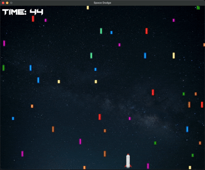

# Space Dodge



## Description
`Space Dodge` is a simple game where the player must dodge falling stars. The game is built using Pygame and features a player-controlled character that moves left and right to avoid the stars.

## Installation
1. Ensure you have Python installed on your system.
2. Clone this repository:
```sh
git clone https://github.com/tehuanmelo/space_dodge.git
```
3. Navigate to the project directory:
```sh
cd space_dodge
```
4. Install the required dependencies:
```sh
pip install -r requirements.txt
```

## Usage

Run the game by executing the following command:
```sh
python main.py
```

## Controls
- **Left Arrow Key**: Move the player to the left.
- **Right Arrow Key**: Move the player to the right.
- **Escape Key**: Quit the game.

## Game Mechanics
- The player must dodge falling lasers.
- The game displays the elapsed time.
- If the player is hit by a laser, the game displays "You lost" and restarts after a delay.


